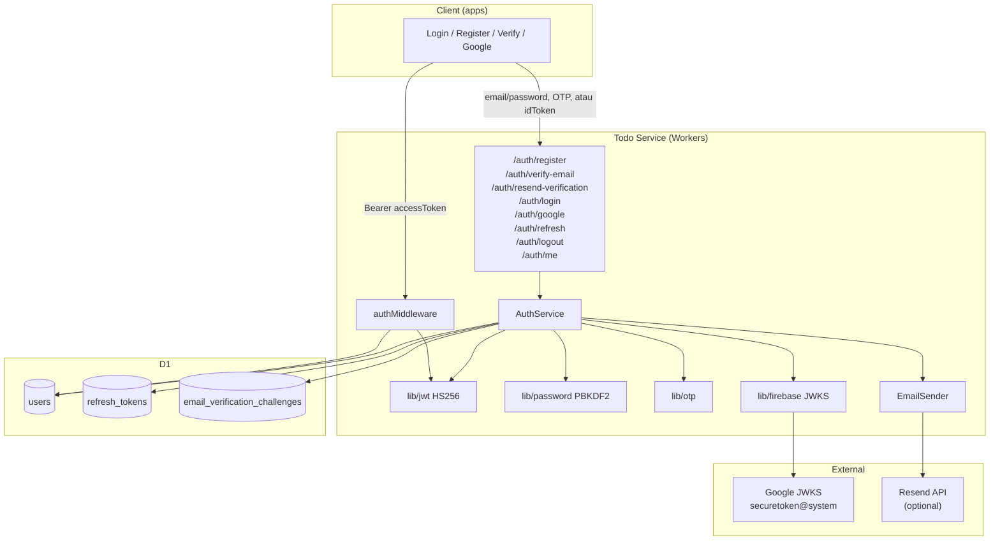
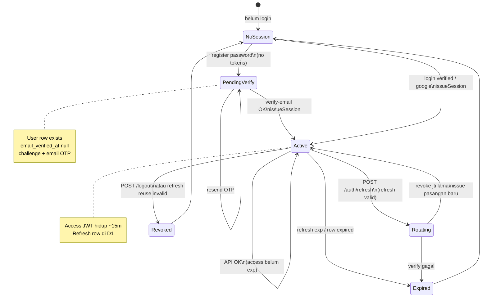
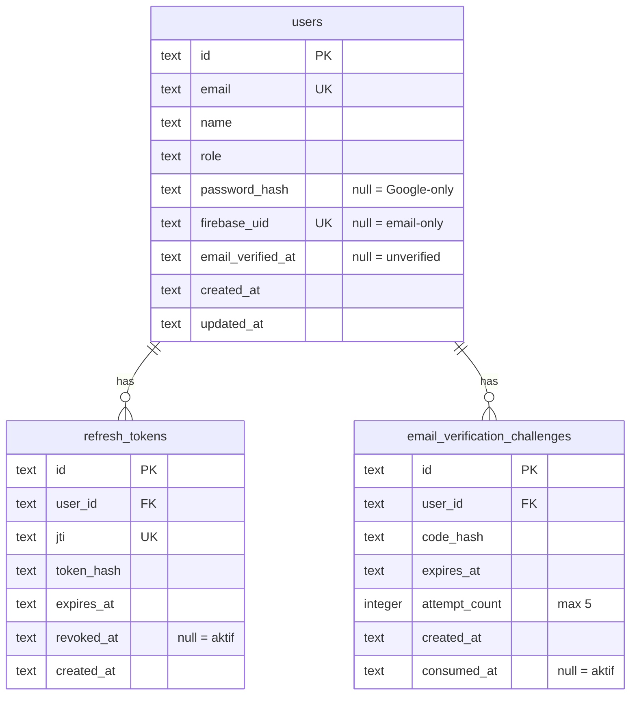
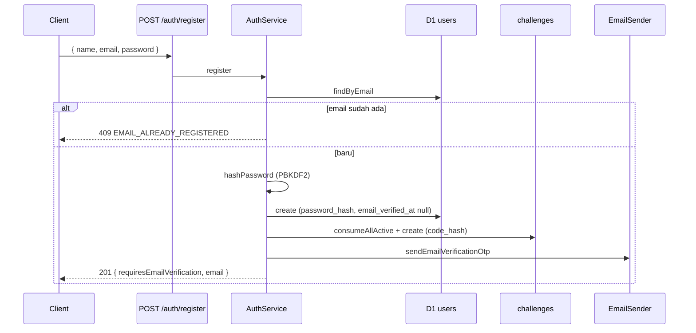
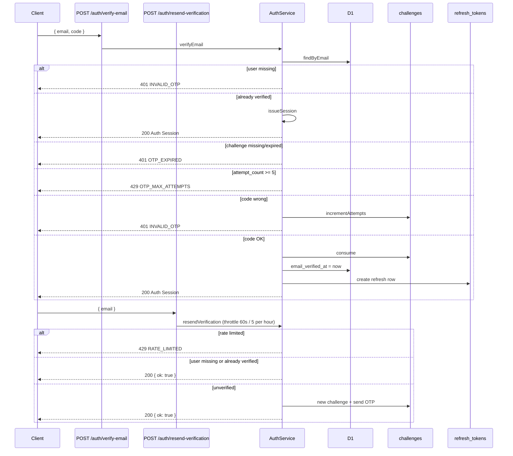
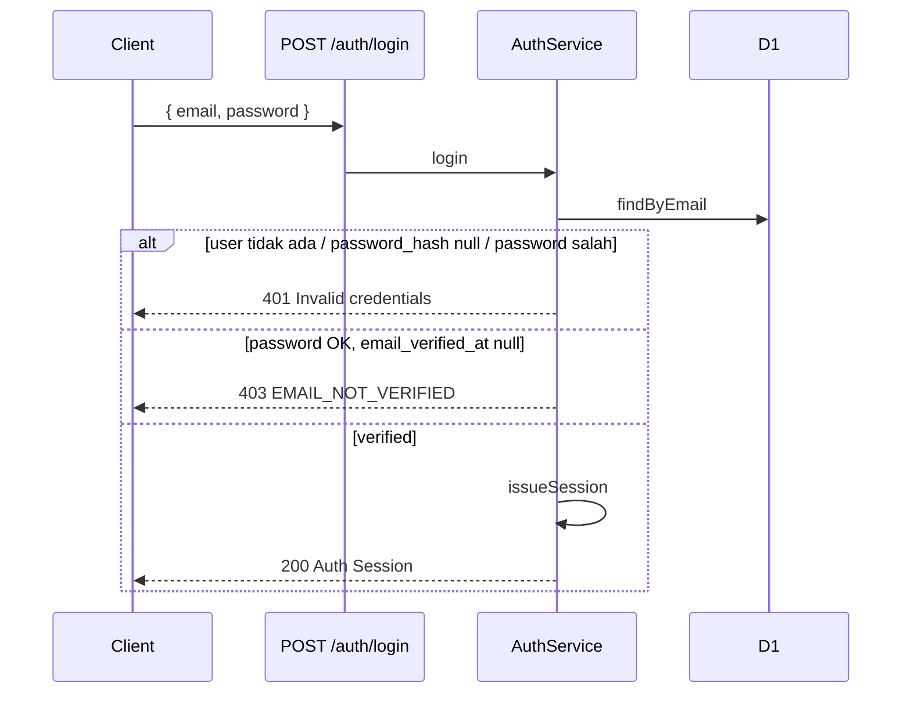
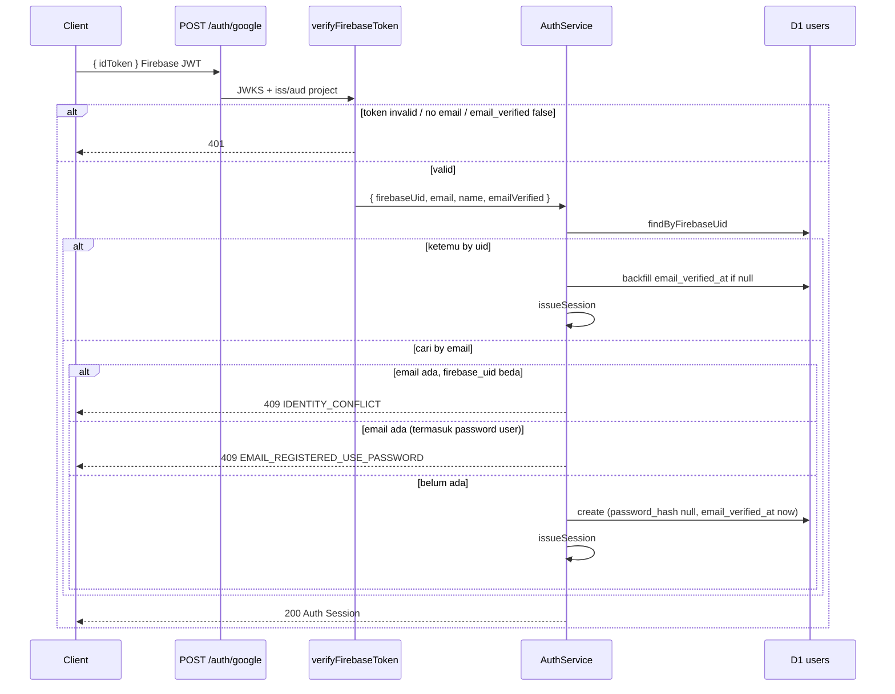
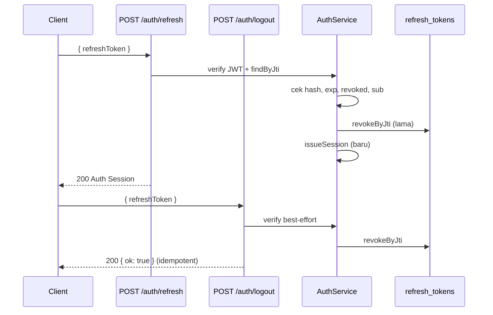

# Auth — How It Works (Service)

Dokumentasi **as-built** sistem auth di backend Todo Service.  
Audience: onboarding full-team. Narasi Indonesia; identifier & path API tetap English.

| Dokumen terkait | Peran |
|-----------------|--------|
| **Dokumen ini** | Cara kerja backend sekarang (diagram, endpoint, JWT, DB) |
| [`architecture.md`](./architecture.md) | Pola modular / di mana kode auth hidup |
| [`adr/`](./adr/) | ADR 0001–0006 (mengapa) |
| [Scalar OpenAPI — tag auth](https://todo-service.rizky-darmarazak.workers.dev/docs#tag/auth) | Kontrak live |

Terakhir diselaraskan dengan kode: **Juli 2026**.

---

## 1. Ringkasan 30 detik

| Pertanyaan | Jawaban |
|------------|---------|
| Cara login apa saja? | Email+password (setelah email verified), dan Google (via Firebase ID token) |
| Siapa yang bikin session API? | Service — **Auth Session** = Public User + access + refresh |
| Register password langsung session? | **Tidak** — 201 pending verification; session setelah OTP |
| Login password unverified? | **403 `EMAIL_NOT_VERIFIED`** — no tokens |
| Token untuk API? | **Access Token** JWT service (`Authorization: Bearer`) |
| Token Google/Firebase untuk API? | **Tidak** — hanya identity proof di `/auth/google` |
| Password disimpan di mana? | Hash PBKDF2 di D1 (`password_hash`), never plain |
| OTP disimpan di mana? | Hash di `email_verification_challenges` (never plain di API) |
| Refresh? | `POST /auth/refresh` + **session rotation** (revoke lama) |
| Google auto-link by email? | **Tidak** — 409 jika email sudah terpakai ([ADR 0006](./adr/0006-no-silent-google-link.md)) |
| Protected route percaya apa? | Access JWT + user masih ada di D1 |

Prinsip: **Identity proof ≠ Auth Session.**  
Password identity proof **belum** cukup untuk session sampai **email verification** lolos.  
Lihat glossary: [CONTEXT.md](../../CONTEXT.md).

---

## 2. Konsep inti

Istilah resmi (jangan dicampur):

| Istilah | Arti di service |
|---------|-----------------|
| **User** | Row `users` di D1 |
| **Public User** | User tanpa `password_hash`; include `emailVerified` (derived) |
| **Identity proof** | Password yang lolos verify, atau Firebase ID token valid |
| **Email verification** | Bukti kepemilikan inbox via OTP sebelum password path dapat session |
| **Verification challenge** | Row OTP aktif: hash, expiry, attempt_count, consumed_at |
| **Auth Session** | `{ user, accessToken, refreshToken, expiresIn }` |
| **Access Token** | JWT `type=access`, TTL 15 menit |
| **Refresh Token** | JWT `type=refresh` + row `refresh_tokens`, TTL 7 hari |
| **Session rotation** | Refresh: revoke `jti` lama → issue pasangan baru |
| **EmailSender** | Interface kirim OTP (`LogEmailSender` / `ResendEmailSender`) |

> **Account linking (silent by email) dihapus.** Google tidak lagi set `firebase_uid` pada password user yang cocok email. Explicit link endpoint = non-goal phase ini. Lihat [ADR 0006](./adr/0006-no-silent-google-link.md).

Detail definisi: [CONTEXT.md](../../CONTEXT.md).  
Keputusan arsitektur: [ADR 0001](./adr/0001-service-owned-session-jwt.md)–[0006](./adr/0006-no-silent-google-link.md).

---

## 3. Arsitektur (diagram)

### 3.1 Big picture



### 3.2 State machine session (server-side)



Login password **unverified** tetap di `NoSession` (403), bukan issue token.

### 3.3 ERD auth



**PublicUser.emailVerified** = `email_verified_at != null` (derived di `toPublicUser`; kolom raw tidak diekspos di API).

---

## 4. Alur login

### 4.1 Email / password — register (pending)



**Tidak ada** access/refresh token di response register.

### 4.2 Email / password — verify + resend



OTP: **6 digit**, CSPRNG; hash SHA-256 (base64); TTL **10 menit**; max **5** wrong attempts per challenge.  
Resend throttle: in-memory per Worker isolate (60s cooldown, max 5 / hour per email) + route rate limiter sebagai backup.

### 4.3 Email / password — login (hard gate)



Catatan:

- Google-only user (`password_hash` null) **tidak** bisa login email — tetap 401 generik.
- Hard gate **setelah** password OK agar tidak bocorkan “email terdaftar tapi unverified” lewat path wrong-password.
- [ADR 0005](./adr/0005-email-verification-hard-gate.md).

### 4.4 Google (no silent link)



**Penting:**

- Body `idToken` harus **Firebase** ID token (`iss: https://securetoken.google.com/<FIREBASE_PROJECT_ID>`), bukan Google OAuth murni. [ADR 0003](./adr/0003-google-via-firebase-id-token.md).
- Claim IdP `email_verified` wajib true.
- **Tidak ada** silent account linking by email. [ADR 0006](./adr/0006-no-silent-google-link.md).

| Condition | Result |
|-----------|--------|
| Token invalid / no email | 401 |
| Firebase `email_verified !== true` | 401 |
| User by `firebase_uid` | Session; backfill `email_verified_at` if null |
| No uid match; email free | Create Google-only verified user → session |
| Email exists, `firebase_uid` null (password) | **409** `EMAIL_REGISTERED_USE_PASSWORD` — no link |
| Email exists, `firebase_uid` different | **409** `IDENTITY_CONFLICT` |

### 4.5 Refresh & logout



---

## 5. Session & JWT

### 5.1 Access Token

| Claim | Isi |
|-------|-----|
| `sub` | `user.id` |
| `role` | `user` \| `admin` |
| `email` | email user |
| `type` | `"access"` |
| `iat` / `exp` | auto; **TTL 15 menit** |

Alg: **HS256**, secret `JWT_SECRET`.

### 5.2 Refresh Token

| Claim | Isi |
|-------|-----|
| `sub` | `user.id` |
| `jti` | UUID unik session refresh |
| `type` | `"refresh"` |
| `iat` / `exp` | auto; **TTL 7 hari** |

Di D1: `token_hash = SHA-256(refreshToken string)` (bukan plain JWT).

### 5.3 issueSession (inti)

Path sukses yang mengeluarkan session: **verify-email**, **login** (verified), **google**, **refresh**.  
Register **tidak** memanggil `issueSession`.

1. Sign access + refresh  
2. Insert `refresh_tokens`  
3. Return `AuthSession` (Public User + `emailVerified`, tanpa password)

Lihat [ADR 0001](./adr/0001-service-owned-session-jwt.md), [ADR 0004](./adr/0004-refresh-token-rotation.md).

### 5.4 Middleware

`authMiddleware`:

1. Header `Authorization: Bearer <access>`  
2. `verifyAccessToken` (`type === access`)  
3. Load User by `sub`  
4. `c.set('user', toPublicUser(user))`  

**Tidak** memverifikasi token Firebase di protected routes.  
**Tidak** re-check `email_verified_at` di middleware: hard gate hanya di issue session password path (unverified user tidak punya token valid kecuali edge case refresh dari session lama — refresh tidak re-gate verification).

---

## 6. Endpoint / kontrak

Base production: `https://todo-service.rizky-darmarazak.workers.dev`

| Method | Path | Body | Sukses |
|--------|------|------|--------|
| `POST` | `/auth/register` | `{ name, email, password }` | 201 `{ requiresEmailVerification: true, email }` |
| `POST` | `/auth/verify-email` | `{ email, code }` (code 6 digit) | 200 Auth Session |
| `POST` | `/auth/resend-verification` | `{ email }` | 200 `{ ok: true }` |
| `POST` | `/auth/login` | `{ email, password }` | 200 Auth Session |
| `POST` | `/auth/google` | `{ idToken }` Firebase | 200 Auth Session |
| `POST` | `/auth/refresh` | `{ refreshToken }` | 200 Auth Session |
| `POST` | `/auth/logout` | `{ refreshToken }` | 200 `{ ok: true }` |
| `GET` | `/auth/me` | Bearer access | 200 Public User |

### Envelope sukses (session)

```json
{
  "success": true,
  "data": {
    "user": {
      "id": "uuid",
      "email": "a@b.com",
      "name": "Name",
      "role": "user",
      "firebaseUid": null,
      "emailVerified": true,
      "createdAt": "...",
      "updatedAt": "..."
    },
    "accessToken": "<jwt>",
    "refreshToken": "<jwt>",
    "expiresIn": 900
  },
  "requestId": "..."
}
```

### Envelope sukses (register pending)

```json
{
  "success": true,
  "data": {
    "requiresEmailVerification": true,
    "email": "a@b.com"
  },
  "requestId": "..."
}
```

### Error codes (stabil untuk FE)

| Situasi | Status | `error.code` |
|---------|--------|----------------|
| Kredensial salah / Google-only + password | 401 | `UNAUTHORIZED` |
| Login password OK, email belum verified | 403 | `EMAIL_NOT_VERIFIED` |
| OTP salah / user missing (opaque) | 401 | `INVALID_OTP` |
| Challenge expired / tidak ada aktif | 401 | `OTP_EXPIRED` |
| Terlalu banyak percobaan OTP | 429 | `OTP_MAX_ATTEMPTS` |
| Resend throttle | 429 | `RATE_LIMITED` |
| Email register duplikat | 409 | `EMAIL_ALREADY_REGISTERED` |
| Google, email milik password account | 409 | `EMAIL_REGISTERED_USE_PASSWORD` |
| Google, `firebase_uid` conflict | 409 | `IDENTITY_CONFLICT` |
| Validasi body | 400 | `VALIDATION_ERROR` |
| Token invalid/expired | 401 | `UNAUTHORIZED` |

`password_hash` dan plain OTP **tidak pernah** di response.

---

## 7. Data model

### `users`

| Kolom | Nullable | Arti |
|-------|----------|------|
| `id` | no | PK UUID |
| `email` | no | unique, lowercased di service |
| `name` | no | |
| `role` | no | `user` \| `admin` |
| `password_hash` | **yes** | null = belum set password (biasanya Google-only) |
| `firebase_uid` | **yes** | null = belum pernah Google |
| `email_verified_at` | **yes** | null = unverified; ISO text saat verified |
| `created_at` / `updated_at` | no | ISO text |

**Migrasi B** (`drizzle/0002_email_verification.sql`): kolom baru nullable, **tanpa backfill** — semua row existing tetap unverified sampai verify OTP (password) atau Google path.

**Seed exception:** `src/db/seed.ts` menulis `email_verified_at = datetime('now')` agar admin/user lokal bisa login tanpa OTP. Hanya seed script; bukan migration.

### `email_verification_challenges`

| Kolom | Arti |
|-------|------|
| `code_hash` | SHA-256 OTP (base64); never plain |
| `expires_at` | create + 10 minutes |
| `attempt_count` | wrong codes; max 5 |
| `consumed_at` | null = aktif; set on success / invalidate |

Rules: satu challenge aktif per user — create baru memanggil `consumeAllActiveForUser`.

### `refresh_tokens`

| Kolom | Arti |
|-------|------|
| `jti` | cocok claim JWT refresh |
| `token_hash` | SHA-256 token |
| `expires_at` | |
| `revoked_at` | null = masih bisa dipakai (sekali, sebelum rotate) |

Password storage: `pbkdf2$iterations$saltB64$hashB64`, iterations **100_000**, [ADR 0002](./adr/0002-password-hash-in-d1.md).

### Email delivery

| Provider | Kapan |
|----------|--------|
| `LogEmailSender` | default / `EMAIL_PROVIDER` bukan `resend` — OTP di worker log (dev) |
| `ResendEmailSender` | `EMAIL_PROVIDER=resend` + `RESEND_API_KEY` + `EMAIL_FROM` |

---

## 8. Security invariants

1. HTTPS di production.  
2. Password plain **tidak** disimpan / dilog.  
3. OTP plain **tidak** di API response; production Resend path tidak log kode.  
4. Unverified password users **tidak** dapat access/refresh (register/login).  
5. Login gagal credential → **401 generik** — jangan bocorkan “email ada”.  
6. `EMAIL_NOT_VERIFIED` hanya setelah password OK.  
7. Resend response generik (tidak leak keberadaan akun); rate-limited.  
8. No silent Google linking by email.  
9. Google requires IdP `email_verified`.  
10. Access pendek; refresh **rotate + revoke**.  
11. Protected API **hanya** access JWT service.  
12. Resend OTP di-throttle per isolate (cooldown + max/hour).  
13. `JWT_SECRET` min 32 chars.  
14. Timing-safe OTP compare.

---

## 9. Peta file (service)

```text
src/
├── app/container.ts                 # wire auth deps + use cases
├── modules/auth/
│   ├── application/                 # use cases (register, login, verify, …)
│   ├── infrastructure/              # D1 repos, JwtTokenService, …
│   └── http/routes.ts               # HTTP endpoints
├── platform/auth/require-auth.ts    # Bearer → resolveAccessUser
├── platform/auth/require-admin.ts
├── lib/jwt.ts · password.ts · otp.ts · firebase.ts · email/
├── db/schema.ts · seed.ts
└── types/schemas.ts                 # Zod body auth
```

Arsitektur penuh: [`architecture.md`](./architecture.md).

---

## 10. Debug / ops

| Gejala | Penyebab tipikal | Fix |
|--------|------------------|-----|
| `HMAC key length (0)` | `JWT_SECRET` kosong di Worker | `npx wrangler secret put JWT_SECRET` |
| `no such table: refresh_tokens` | Migration auth belum remote | `npm run db:migrate:auth:prod` |
| `no such table: email_verification_challenges` | Migration email belum remote | `npm run db:migrate:email:prod` |
| `/auth/google` 401 signature | Bukan Firebase ID token / project salah | Cek `iss` di jwt.io; `FIREBASE_PROJECT_ID` |
| Login 401 terus | User Google-only atau password salah | Register dulu / cek `password_hash` |
| Login 403 `EMAIL_NOT_VERIFIED` | Password OK, belum OTP | `/auth/verify-email` atau resend; local: cek log OTP |
| Register OK tapi tidak ada email | `EMAIL_PROVIDER` = log | Lihat wrangler log `email_verification_otp` |
| Resend 429 | Cooldown 60s / 5 per hour | Tunggu; client UI cooldown |
| OTP 401 terus | Code expired / salah / hash mismatch | Resend; pastikan code 6 digit |
| Google 409 `EMAIL_REGISTERED_USE_PASSWORD` | Email sudah password account | Login password + verify; explicit link belum ada |
| Refresh 401 | Revoked, expired, atau hash mismatch | Login ulang |
| Seed admin tidak bisa login | INSERT lama tanpa `email_verified_at` | Re-run seed dengan kolom verified, atau verify via log OTP |

```bash
cd service
npx wrangler tail --search 'http_error'
npx wrangler tail --search 'email_verification_otp'   # LogEmailSender dev
# Logger: docs/logger.md
```

Local `.dev.vars` **tidak** otomatis ke production.

Env penting:

| Var | Peran |
|-----|--------|
| `JWT_SECRET` | Sign access/refresh (secret) |
| `FIREBASE_PROJECT_ID` | Verify Google path only |
| `EMAIL_PROVIDER` | `log` (default) \| `resend` |
| `RESEND_API_KEY` | Required if provider=resend |
| `EMAIL_FROM` | Required if provider=resend (verified sender) |
| `DB` | D1 binding |

Production email:

```bash
# secrets
npx wrangler secret put RESEND_API_KEY
# EMAIL_FROM + EMAIL_PROVIDER=resend di wrangler vars / secrets sesuai setup

# migration
npm run db:migrate:email:prod
```

---

## 11. Referensi

| Resource | Path / URL |
|----------|------------|
| Design JWT session | [auth-jwt-session-design.md](./superpowers/specs/2026-07-17-auth-jwt-session-design.md) |
| Design email verification | [email-verification-design.md](./superpowers/specs/2026-07-18-email-verification-design.md) |
| ADR session JWT | [0001](./adr/0001-service-owned-session-jwt.md) |
| ADR password D1 | [0002](./adr/0002-password-hash-in-d1.md) |
| ADR Google/Firebase | [0003](./adr/0003-google-via-firebase-id-token.md) |
| ADR refresh rotation | [0004](./adr/0004-refresh-token-rotation.md) |
| ADR email hard gate | [0005](./adr/0005-email-verification-hard-gate.md) |
| ADR no silent Google link | [0006](./adr/0006-no-silent-google-link.md) |
| Glossary | [CONTEXT.md](../../CONTEXT.md) |
| Client how-it-works | [apps/docs/auth-flow.md](../../apps/docs/auth-flow.md) |
| Google native setup | [apps/docs/google-sign-in.md](../../apps/docs/google-sign-in.md) |
| OpenAPI Scalar | https://todo-service.rizky-darmarazak.workers.dev/docs#tag/auth |
| Logger | [logger.md](./logger.md) |
